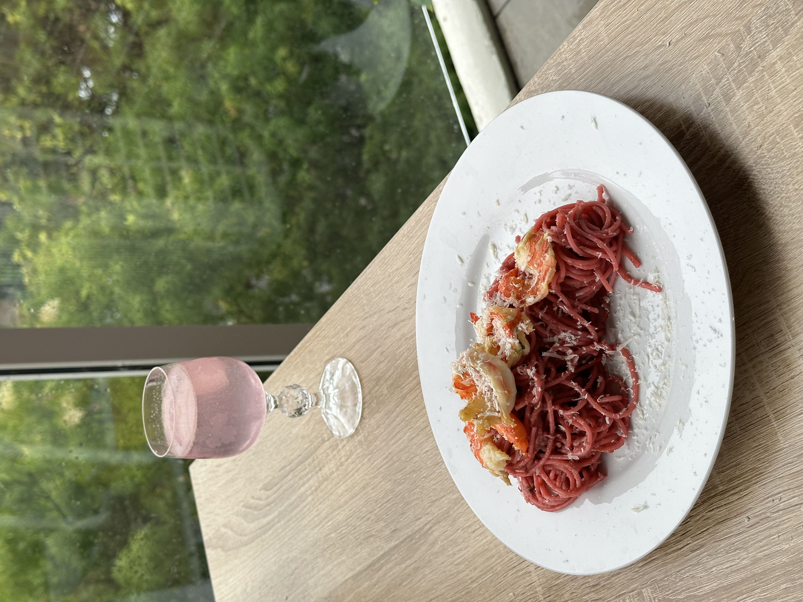

<header>
        <h1> My Hobbies </h1>
    </header>

    <main>
        <ul class="hobby-list">
            <li class="hobby-item" data-hobby="hobby1">Digital content creating</li>
            <li class="hobby-item" data-hobby="hobby2">Traveling and adventure</li>
            <li class="hobby-item" data-hobby="hobby3">Singing</li>
        </ul>   

        

             <h2>Fashion/lifestyle/Art directing</h2>
                
                
                
                
        

        

            <h2> Travel and Adventure</h2>
            
            
            
            
        

        

            <h2>Singing</h2>
            
            
        

    </main>

    <footer> 
        <h2> Get in touch with me </h2>
        <a href ="mailto:ayeanuska@gmail.com">Email</a> 
        <a href ="mailto:ayeanuska@gmail.com">Instagram</a> 
        <a href ="mailto:ayeanuska@gmail.com">Linkedin</a> 
    </footer>

    

table{
  justify-content: center;
  align-items: center;
  width: 20%; 
  height: auto; 
 }